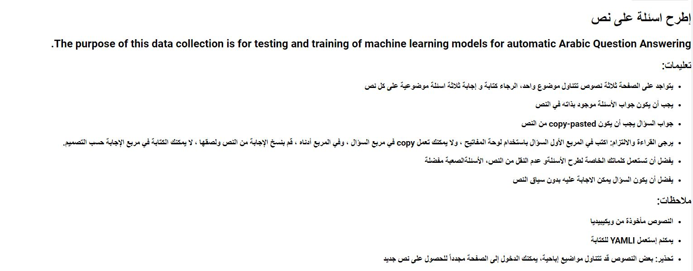

**Addtional Requirements**:
```
polyglot
google-cloud-translate
```

## Translating and Processing SQuAD
The following is the process we followed to translate the Stanford Question Answering Dataset and process it. If you want to go through it again make sure you read the code well and modify it to your own needs, you will need to obtain credentials for the Google Translate API first. The translation will be costly, it may require more than 100$ in Google credits and processing will take a couple of hours.

*  First download the SQuAD datasets: train https://rajpurkar.github.io/SQuAD-explorer/dataset/train-v1.1.json, and dev https://rajpurkar.github.io/SQuAD-explorer/dataset/dev-v1.1.json

*  Use dataset_creation/translate_squad.py to translate SQuAD while also giving your credential, the script will modify the input SQuAD dataset while processing.
```shell
python translate_squad.py ^
-c CREDENTIALS_DIRECTORY ^
-s SQUAD_DIRECTORY
```

Before processing, we need to download the polyglot library, for Windows the installation may be a bit annoying:

Go to https://www.lfd.uci.edu/~gohlke/pythonlibs/#pycld2 to install PyCLD2 and PyICU wheels then install from folder using pip, after that you can pip install polyglot.
Then you need the models: from command line: polyglot download embeddings2.en transliteration2.ar. Then in python run the following to download all transliteration models:
```shell
from polyglot.downloader import downloader
downloader.download("TASK:transliteration2", quiet=False)
```
For more info go to https://polyglot.readthedocs.io/en/latest/Transliteration.html#languages-coverage

* To transliterate and fix the answers, run fix_answers.py located dataset_creation directory:
```shell
python fix_answers.py ^
-i SQUAD_DIRECTORY ^
```
The script will create a new .json dataset in the same SQUAD_DIRECTORY.

## Crowdsourcing of the Arabic Reading Comprehension dataset

Interested in extending the Arabic Reading Comprehension dataset ? We have uploaded the html file used for the HIT on Amazon Mechanical Turk "crowd_task.html", an example batch "turk_batch_example.csv" and a script to convert worker's results into a .json file formated in the manner of SQuAD "extract_turk_batch.py". All files are available in the dataset_creation folder.


